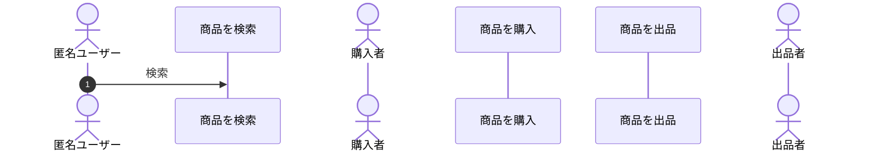

# C2Cのコマースアプリケーション開発

### アクター ：　匿名ユーザー、購入者、出品者

### ユースケース : 「商品を検索」、「商品を購入」、「商品を出品」「出品者のプロファイルを表示」、「サインイン」

```mermaid
sequenceDiagram
    autonumber
    actor 匿名ユーザー
    participant search as 商品を検索
    匿名ユーザー->>search: 検索
    actor 購入者
    participant purchase as 商品を購入
    participant listing as 商品を出品
    actor 出品者
```